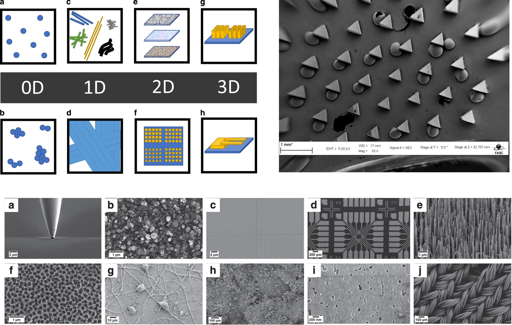

# ARIM-Academy：機器データ利活用ユースケース

## タイトル：CNNによるSEM画像からのナノ構造体の分類

### 機器：走査電子顕微鏡（SEM）
### 分析：畳み込みニューラルネットワーク（LeNet-5 / CNN / Xception）

走査電子顕微鏡（SEM）で得られたナノ構造体の画像を、深層学習で10カテゴリに自動分類する教材です。**1998年のLeNet-5から現代の転移学習まで、CNNの発展を3冊でたどります。** 3冊とも同じデータ・同じテストセット・同じ評価指標を使うので、「設計を変えると結果がどう動くか」を一本の線で追うことができます。

---

## ノートブック構成

| # | ノートブック | ねらい | Colab |
| --- | --- | --- | --- |
| 1 | `1_LeNet-5.ipynb` | **歴史編・文法編** — 1998年のLeNet-5を原典に忠実に再現し、Kerasで層を組む文法を1つずつ習得する | [](https://colab.research.google.com/github/ARIM-ACADEMY-2026/Advanced_Tutorial_9_SEM-Image-Classification/blob/main/1_LeNet-5.ipynb) |
| 2 | `2_CNN.ipynb` | **現代化編** — LeNet-5を出発点に、解像度・活性化関数・プーリング・正則化を現代的な設計へ更新し、ハイパーパラメータを探索する | [](https://colab.research.google.com/github/ARIM-ACADEMY-2026/Advanced_Tutorial_9_SEM-Image-Classification/blob/main/2_CNN.ipynb) |
| 3 | `3_Xception.ipynb` | **転移学習編** — ImageNetで事前学習されたXceptionを流用し、ゼロから学習したCNNと比較する | [](https://colab.research.google.com/github/ARIM-ACADEMY-2026/Advanced_Tutorial_9_SEM-Image-Classification/blob/main/3_Xception.ipynb) |

**1 → 2 → 3 の順に実行してください。** 各冊は単体でも実行できますが、後の冊は前の冊が出力した比較結果（`output/model_comparison_*.csv`）を読み込んで並べて表示します。

---

## 3冊のつながり ― 何が変わって、何が変わらないのか

### 変わるもの

| | 1_LeNet-5 | 2_CNN | 3_Xception |
| --- | --- | --- | --- |
| **年代** | 1998年 | 2010年代の標準的な設計 | 2017年（Xception論文） |
| **入力** | 32×32 グレースケール | 100×100 グレースケール | 128×128 RGB |
| **畳み込み** | 6ch → 16ch（2層） | 32ch → 64ch → 64ch（3層） | 深さ方向分離可能畳み込み（36層） |
| **活性化関数** | tanh | ReLU | ReLU |
| **プーリング** | 平均プーリング | 最大プーリング | 最大プーリング＋大域平均プーリング |
| **最適化** | SGD | Adam | Adam（2段階、学習率を1/100に） |
| **パラメータ数** | 約6万 | 数十万〜数百万 | 約2,100万 |
| **重みの出どころ** | ランダム初期値 | ランダム初期値 | **ImageNet（約1,400万枚）** |
| **設計の決め方** | 論文の固定構成 | 検証データによる総当たり探索 | 事前学習済み構造をそのまま流用 |
| **Keras API** | Sequential（＋Functionalとの書き比べ） | Sequential | Functional |

### 変わらないもの

- **畳み込み → プーリング → …… → 平坦化 → 全結合** という骨格。LeNet-5が1998年に確立した構成で、2,100万パラメータのXceptionの内部でも同じ原理が働いています
- **局所受容野・重み共有・サブサンプリング** という3つの発想
- **データの分割**（訓練1,023 / 検証341 / テスト341、層化抽出、乱数シード42）。3冊とも同じ画像がテストデータになります。各冊が表示する**分割チェックサム `290658`** が一致することで確認できます
- **評価の枠組み**（多数派ベースライン、accuracy、balanced accuracy、macro-F1）

この設計により、3冊の結果を並べたときの差は**純粋にモデル設計の違い**として読めます。

---

## 対象読者・前提知識

- **対象読者**：ARIMデータポータル会員の研究者・技術者。Pythonの基礎文法（変数・関数・for文・リスト）を理解している方
- **前提知識**：統計学・機械学習・深層学習の予備知識は前提としません。TensorFlow / Keras に初めて触れる方を想定しています
- **所要時間**：GPU環境で全3冊あわせて約45〜70分（1冊目はCPUでも完走できます）

### 1冊目で身につくKerasの文法

`1_LeNet-5.ipynb` は、CNNの歴史を扱うと同時に **Kerasの文法を体系的に学ぶ冊** です。LeNet-5は層が7つしかなく全パラメータを手計算で検算できるため、教材として最適です。

| やりたいこと | 学ぶ内容 |
| --- | --- |
| 一本道のモデルを作る | `Sequential` に `add()` する書き方／リストで渡す書き方 |
| 分岐のあるモデルを作る | Functional API（`x = layer(x)` と `keras.Model(inputs, outputs)`） |
| 各層の引数を理解する | `Conv2D` の `filters` / `kernel_size` / `strides` / `padding` / `activation` |
| データの形の変化を追う | 出力サイズの式 $(W-K+2P)/S+1$ を手計算し `model.summary()` と照合 |
| パラメータ数を検算する | $(K \times K \times C_{in} + 1) \times C_{out}$ を手計算し `summary()` と照合 |
| 学習のルールを決める | `compile(optimizer=, loss=, metrics=)`、`from_logits` の意味 |
| 学習する | `fit(epochs=, batch_size=, validation_data=, callbacks=)`、`history` の中身 |
| 評価・予測する | `evaluate()` と `predict()` の使い分け、ロジット→softmax |
| 学習を自動で打ち切る | `EarlyStopping(restore_best_weights=True)` |
| モデルを保存・読込する | `ModelCheckpoint`、`model.save("xxx.keras")`、`load_model()` |

**検算の例**：本教材のLeNet-5実装は 61,706 パラメータで、原論文の「約60,000個」との差 1,706 個は、①C3層の疎結合→全結合（+900）、②学習可能なサブサンプリング係数の消失（−44）、③RBF出力層→`Dense(10)`（+850）で**完全に説明できます**。深層学習のコードは間違っていても動いてしまうため、検算できる箇所は必ず検算する——という姿勢を身につけてもらう仕掛けです。

---

## 動作環境

| 項目 | 内容 |
| --- | --- |
| 推奨実行環境 | Google Colab（2冊目・3冊目は**GPUランタイム**推奨。1冊目はCPUで可） |
| Python | 3.10 以上 |
| 主なライブラリ | `tensorflow>=2.16`, `opencv-python`, `scikit-learn`, `pandas`, `numpy`, `matplotlib`, `seaborn` |
| ネットワーク | 3冊目のみ、ImageNet事前学習済み重み（約80MB）を初回実行時にダウンロードします |

Colab では上記ライブラリはすべてプリインストール済みです。ローカル環境の場合は次のとおり導入してください。

```bash
pip install "tensorflow>=2.16" opencv-python scikit-learn pandas numpy matplotlib seaborn
```

Colab では「ランタイム」→「ランタイムのタイプを変更」→ ハードウェアアクセラレータに **GPU** を選択してください。

---

## データセット

『ナノ構造体のSEMデータセット』は、イタリア CNR-IOM（トリエステ）の TASC 研究所で、約100名の研究者が5年間かけて **ZEISS SUPRA 40 電界放出型SEM** で取得した画像を人手でアノテーションした、初の公開SEM画像データセットです。公開されている Majority dataset は **21,272枚**（論文本文では「約22,000枚」）で、10カテゴリに分類されています。

カテゴリは 0D物体（粒子）、1D構造（ナノワイヤ・繊維）、2D構造（膜・コーティング表面・パターン表面）、3D構造（MEMSデバイス等）に加え、探針（Tips）や生物試料（Biological）を含みます。

### 本リポジトリに同梱しているデータ

セミナー時間内に学習が完了するよう、全21,272枚のうち **1,705枚**を抜粋して `data/training_data/` に収録しています。**カテゴリごとの枚数は大きく偏っています。**

| カテゴリ | 枚数 | 割合 |
| --- | ---: | ---: |
| Biological | 100 | 5.9% |
| Fibres | 100 | 5.9% |
| Films_Coated_Surface | 100 | 5.9% |
| MEMS_devices_and_electrodes | 100 | 5.9% |
| Nanowires | 100 | 5.9% |
| Particles | 100 | 5.9% |
| Patterned_surface | 100 | 5.9% |
| Porous_Sponge | 100 | 5.9% |
| **Powder** | **895** | **52.5%** |
| **Tips** | **10** | **0.6%** |
| 合計 | 1,705 | 100% |

`Powder` だけで全体の半分を占めるため、**「常に Powder と答えるだけのモデル」でも正解率は52.5%**に達します。この **多数派ベースライン** を基準にしなければ、モデルの実力は判断できません。3冊とも、正解率に加えて **balanced accuracy** と **macro-F1** を必ず併記します。

そのほか `data/prediction_data/` には、学習に使わない検証用の画像を2枚（`biology.jpg`, `fiber.jpg`）収録しています。

### 画像の仕様と前処理

- 画像サイズは **1,024 × 768 ピクセル**の JPEG（グレースケール）
- 下部の **636〜698行目**（高さ約60px）に、加速電圧（EHT）・ワーキングディスタンス（WD）・倍率（Mag）・検出器名などを記した **情報バー（データバー）** が焼き込まれています

情報バーを残したまま学習させると、CNNが試料の形態ではなく**焼き込まれた文字**を手がかりに分類してしまう危険があります（ショートカット学習）。3冊とも前処理で 630行目までを残して切り落とし、`cv2.INTER_AREA` で縮小しています。

### 出典・ライセンス

[1] Rossella Aversa, Mohammad Hadi Modarres, Stefano Cozzini, Regina Ciancio & Alberto Chiusole, *The first annotated set of scanning electron microscopy images for nanoscience*, **Scientific Data 5, 180172 (2018)**, DOI: [10.1038/sdata.2018.172](https://doi.org/10.1038/sdata.2018.172)

原データセットは **CC BY 4.0** で公開されています。本リポジトリはその一部を同条件で再配布しています。利用時は上記文献を引用してください。



---

## 各冊の内容

### 1_LeNet-5.ipynb — CNNの原点とKerasの文法

1. **CNNの原点** — 時代背景、LeNet-5が持ち込んだ3つの考え方（局所受容野・重み共有・サブサンプリング）、アーキテクチャ図（図1）、原典と現代実装の差分
2. **データの準備** — 32×32への縮小で何が失われるか（図2）、クラス不均衡（図3）、層化3分割
3. **Kerasの文法①：Sequential API** — 各層の引数、出力サイズの手計算、パラメータ数の手計算と `summary()` との照合、原典60,000パラメータとの差分の完全な内訳
4. **Kerasの文法②：Functional API** — 同じモデルを2通りで書き、等価であることを確認
5. **Kerasの文法③：compile / fit / evaluate / predict** — 損失関数と `from_logits`、最適化アルゴリズム、`history`、コールバック、保存と読込
6. **評価** — 学習曲線（図4）、混同行列（図5）
7. **現代化のアブレーション実験** — tanh vs ReLU（図6）、平均 vs 最大プーリング（図7）、部品を1つずつ入れ替えた効果（図8）
8. **モデル比較**（図9）、**未知画像の予測**（図10）
9. まとめ／扱っていないこと／演習問題7問

### 2_CNN.ipynb — 現代的な小規模CNNへ

1. **1冊目からの続き** — 何を変え、何を変えないかの一覧
2. **データの実態確認** — カテゴリ別枚数、情報バーの検出と除去（図1〜図3）
3. **層化3分割**（図4）
4. **ベースラインCNN** — LeNet-5からの設計変更の理由を1項目ずつ説明。学習曲線と混同行列（図5・図6）
5. **ハイパーパラメータ探索** — 12通りの総当たり。**選択には検証データのみを使用**（図7〜図9）
6. **モデル比較** — 1冊目のLeNet-5を含む比較（図10）
7. **未知画像の予測**（図11）
8. まとめ／扱っていないこと／演習問題7問

### 3_Xception.ipynb — 転移学習

1. **転移学習の考え方** — なぜ少量データで有効なのか
2. **事前学習済みモデル固有の前処理** — `preprocess_input` はモデルごとに違う（Xceptionは `[-1, 1]`、VGGは平均減算、EfficientNetは生の値）。実データで一致を `assert` 検証（図1）
3. **第1段階：特徴抽出** — ベースモデルを凍結し分類器のみ学習
4. **第2段階：ファインチューニング** — `block13` 以降を解凍、学習率を1/100に（図2・図3）
5. **シリーズ3冊の総まとめ比較**（図4）、カテゴリ別F1（図5）
6. **未知画像の予測**（図6）
7. まとめ／扱っていないこと／演習問題6問

---

## フォルダ構成

```
.
├── 1_LeNet-5.ipynb               # 1冊目：CNNの原点とKerasの文法
├── 2_CNN.ipynb                   # 2冊目：現代的な小規模CNN
├── 3_Xception.ipynb              # 3冊目：転移学習
├── README.md
├── LICENSE
├── data/
│   ├── training_data/            # 学習用画像（10カテゴリ、1,705枚）
│   │   ├── Biological/
│   │   ├── Fibres/
│   │   └── ...
│   └── prediction_data/          # 未知画像（2枚）
├── img/
│   └── image.png                 # README用イメージ
├── output/                       # 実行すると生成される（図・CSV・データキャッシュ）
└── model/                        # 実行すると生成される（学習済みモデル）
```

`output/` と `model/` はノートブックの実行時に自動生成されます。生成物をノートブック直下に散らかさないための構成です。

### 冊をまたぐ受け渡し

```
1_LeNet-5.ipynb  →  output/model_comparison_lenet.csv
                             ↓
2_CNN.ipynb      →  output/model_comparison_cnn.csv（LeNet-5の結果を取り込む）
                             ↓
3_Xception.ipynb →  output/model_comparison_all.csv（3冊すべての結果）
```

前の冊を実行していなくてもエラーにはならず、その冊の結果だけで比較表が作られます。

---

## 改訂履歴

### 第3版（2026-07-26） ― LeNet-5編の追加と3冊構成への再編

- **`1_LeNet-5.ipynb` を新規作成**。CNNの歴史的経緯と、KerasでDNNを構成する文法（Sequential / Functional / compile・fit・evaluate・predict / コールバック / 保存・読込）を体系的に扱う冊として位置づけた
- 原典（LeCun et al., 1998）を**忠実に再現**（32×32入力、tanh、平均プーリング、C1-S2-C3-S4-C5-F6-出力）したうえで、Kerasの標準部品では再現できない3点（学習可能なサブサンプリング、C3の疎結合テーブル、RBF出力層）を明示。パラメータ数の差 1,706 個の内訳を完全に説明
- **現代化のアブレーション実験**（tanh→ReLU→最大プーリング→Adam）を追加し、LeNet-5編から現代CNN編への橋渡しとした
- `1_CNN_baseline.ipynb` → **`2_CNN.ipynb`** に改名。冒頭に「1冊目から何を変えるか」の対応表を置き、LeNet-5との違いが混乱なく読めるようにした
- `2_Xception.ipynb` → **`3_Xception.ipynb`** に改名
- 3冊すべての冒頭に**シリーズ地図**を配置。各冊末尾に次冊への橋渡しを追加
- 冊をまたぐ比較CSVの連携を整備（`model_comparison_lenet.csv` → `_cnn.csv` → `_all.csv`）

### 第2版（2026-07-25） ― 全面的な品質改善

初版（`1_LuNet-5.ipynb` / `2_Xception.ipynb`）には、実行不能な箇所や誤った結果を生む箇所が複数ありました。

| 箇所 | 内容 |
| --- | --- |
| 最良モデルの保存 | `best_model = model` の代入が抜けており、保存セルは沈黙し、続く読み込みセルは `FileNotFoundError` になる状態でした |
| Xception編・予測セクション | 学習済みモデルを捨てて**未学習のXceptionを作り直して**予測していました。残っていた「確率1.0で正解」という出力は別実行の残骸（stale output）でした |
| 未知画像の前処理 | 学習時は `/255` で正規化していたのに、推論時に正規化が無く、入力スケールが食い違っていました |
| Xceptionの前処理 | `/255`（0〜1）のまま入力していましたが、Xceptionが期待するのは `[-1, 1]` です |
| 層数のオフバイワン | `for _ in range(conv_layer - 1)` により、`conv_layers=0` と `1` がどちらも畳み込み1層になっていました |
| `load_best_model()` | 「最良」ではなく「更新時刻が最新」のファイルを読み込む実装でした |
| `%time` | 単独行の `%time` は直後の空文を計測するだけで、学習時間は測れていませんでした |

方法論としても、①テストデータをモデル選択に使っていた点を3分割で解消、②`stratify` を導入、③balanced accuracy・macro-F1・多数派ベースラインを併記、④情報バーの除去、⑤前処理の `Rescaling` 層によるモデル内蔵化、⑥転移学習の2段階化、を行いました。また「LuNet-5」が LeNet-5 の誤記であり実装もLeNet-5ではなかったことを明記しました（第3版で本物のLeNet-5編を追加）。

---

## 検証状況

- データセットの枚数・クラス構成・画像サイズ・情報バーの位置は、同梱の実データで確認済み
- LeNet-5のパラメータ数（原典60,000 / Keras実装61,706）と特徴マップサイズは手計算で検算済み
- 前処理・分割・評価・作図の各ロジック、および冊をまたぐCSV連携は実行して検証済み
- **分割チェックサム `290658` が3冊すべてで一致**することを確認済み（訓練1,023 / 検証341 / テスト341、`Tips` のテストは2枚）
- **TensorFlowによる学習セルは未実行**です。学習結果の数値・図は、利用者の環境（Colab推奨）で生成されます

---

## ライセンス

- **コード（ノートブック）**：MIT License
- **同梱データ**：CC BY 4.0（Aversa et al., 2018 の派生物）

## 参考文献

[1] R. Aversa, M. H. Modarres, S. Cozzini, R. Ciancio, A. Chiusole, *The first annotated set of scanning electron microscopy images for nanoscience*, **Scientific Data 5, 180172 (2018)**, DOI: [10.1038/sdata.2018.172](https://doi.org/10.1038/sdata.2018.172)

[2] Y. LeCun, L. Bottou, Y. Bengio, P. Haffner, *Gradient-based learning applied to document recognition*, **Proceedings of the IEEE 86(11), 2278–2324 (1998)**, DOI: [10.1109/5.726791](https://doi.org/10.1109/5.726791)

[3] F. Chollet, *Xception: Deep Learning with Depthwise Separable Convolutions*, **CVPR 2017**, arXiv: [1610.02357](https://arxiv.org/abs/1610.02357)

[4] D. P. Kingma, J. Ba, *Adam: A Method for Stochastic Optimization*, **ICLR 2015**, arXiv: [1412.6980](https://arxiv.org/abs/1412.6980)
